# Exploring Sex Differences in Colon Adenocarcinoma: A Transcriptomic Approach

## **Background**

Colorectal cancer is the third most common cancer diagnosed and the second leading cause of cancer-related mortality worldwide [1]. The distribution of colorectal cancer differs across the worldwide population, with an evident difference in incidence and mortality by different demographic covariates, such as race, sex, and age [2].
Colon adenocarcinoma (COAD) shows clinically significant differences between sexes, with men tending to develop the disease earlier and often experiencing worse outcomes compared to women [3]. These disparities suggest that underlying biological mechanisms related to sex differences may contribute to these clinical observations [3-5].
Understanding the molecular basis for these differences is essential for improving therapeutic strategies and patient outcomes. This project aims to explore the transcriptomic differences between males and females with COAD using RNA-seq data from The Cancer Genome Atlas (TCGA), to investigate potential biomarkers for sex-specific outcomes and overall survival (OS).

## **Biological question**

The main question guiding this project is: *Are there fundamental biological differences between males and females in colon adenocarcinoma that influence disease progression and survival?*

Specifically, this study investigates whether sex-specific gene expression patterns can be linked to differences in prognosis and whether distinct gene signatures for males and females can predict OS outcomes.

## **Repository structure**

```
TCGA_COAD_sex_differences/
│-- Code/     # contains a script to reproduce the workflow and a script for the analysis
│-- Data/     # contains unprocessed and processed metadata
│-- Figures/  # contains figures produced by the script
│-- LICENSE
│-- README.md
```

## **Project dependencies**

This project is carried out using R 4.4.2 and the following R packages:
- **Bioconductor Packages**:  
  - `TCGAbiolinks`  
  - `SummarizedExperiment`  
  - `biomaRt`
- **CRAN Packages**:  
  - `gplots`
  - `ggplot2`
  - `dplyr`
  - `gtsummary`
  - `viridis`
  - `prodlim`
  - `survival`
  - `kableExtra`
  - `DiagrammeR`

## **Data sources and workflow of the analysis**

RNA-seq data of the TCGA-COAD cohort was downloaded directly into R using the Bioconductor package `TCGAbiolinks`. Metadata with survival information was downloaded from UCSC XENA and can be found in the [Data folder](https://github.com/manal-agdada/TCGA_COAD_sex_differences/tree/main/Data) alongside the processed metadata dataframe used for the analysis in this study.

Only primary tumor samples were directly downloaded to avoid biases from the presence of normal or metastatic samples.

Below, a schematic of the pipeline used in the analysis is presented. In particular, the analysis consists of:

1. Data selection, preprocessing, normalization, and filtering
2. Differential expression analysis using the pipeline edgeR
3. Functional enrichment analysis
4. Survival analysis with Cox PH regression models and Kaplan-Meier curves

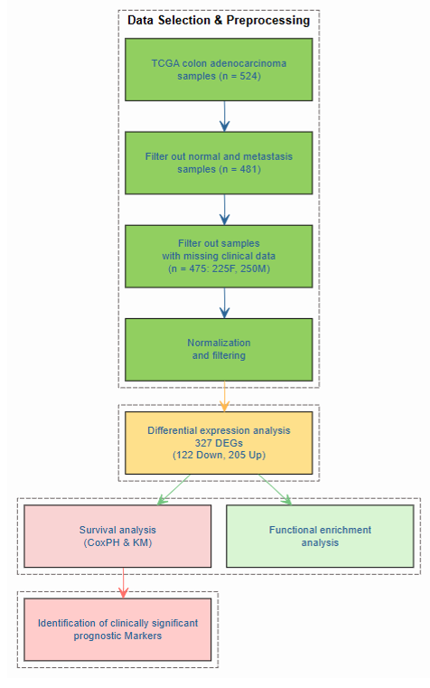


### **Selection, preprocessing, normalization, and filtering**

Only primary tumors samples were downloaded excluding normal and metastasis samples with a total of 474 samples. Also, samples from patients that were subjected to prior treatments before the collection and sequencing were excluded. 
The clinical covariantes considered in this study are the following: sex, age, race, prior malignancy, tumor site, tumor stage, OS time, and survival status. Therefore, samples with missing data were excluded, rounding up a total of 465 samples (244 male samples and 221 female samples).

Below, a demographics of the cohort under study is presented stratified by sex. All clinical data appear to be distributed homogeneously between male and female patients.

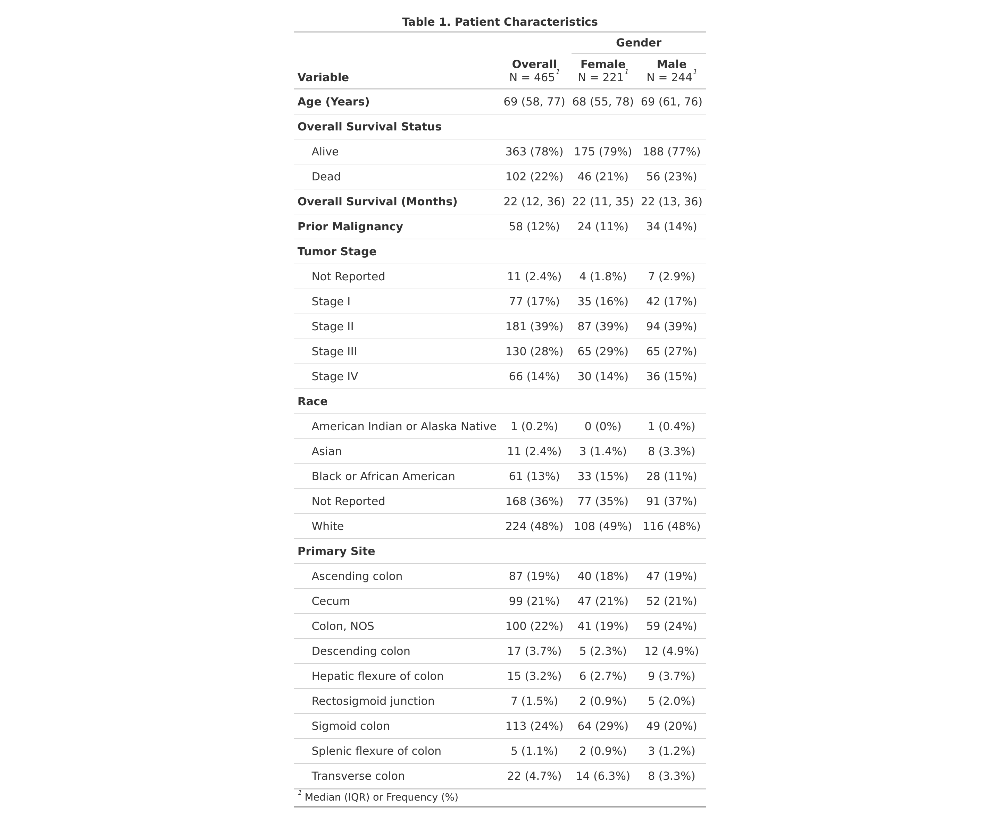

The gene expression matrix under study comprises of 465 samples and 60660 genes. Normalization was applied using the `TCGAanalyze_Normalization` function from the `TCGAbiolinks` package accounting for sequencing depth and gene length. After normalization, 38691 genes were removed as lowly expressed genes, rounding up to a total of 21969 genes that will be used for subsequent analysis.

### **Differential expression analysis**

Differential expression analysis was run to identify genes that are differentially expressed between males and females in COAD. The analysis was performed using the `TCGAanalyze_DEA` function from the `TCGAbiolinks` package using `edgeR` as pipeline. A significant threshold of FDR < 0.01 and |logFC| > 1 was applied to identify 325 differentially expressed genes (DEGs), with 128 upregulated and 197 downregulated in males. Also, 276 of these DEGs are from autosomes, 19 from the X chromosome, and 26 from the Y chromosome.

Below, a barplot of the top 50 DEGs based on logFC and localization in the genome is presented.

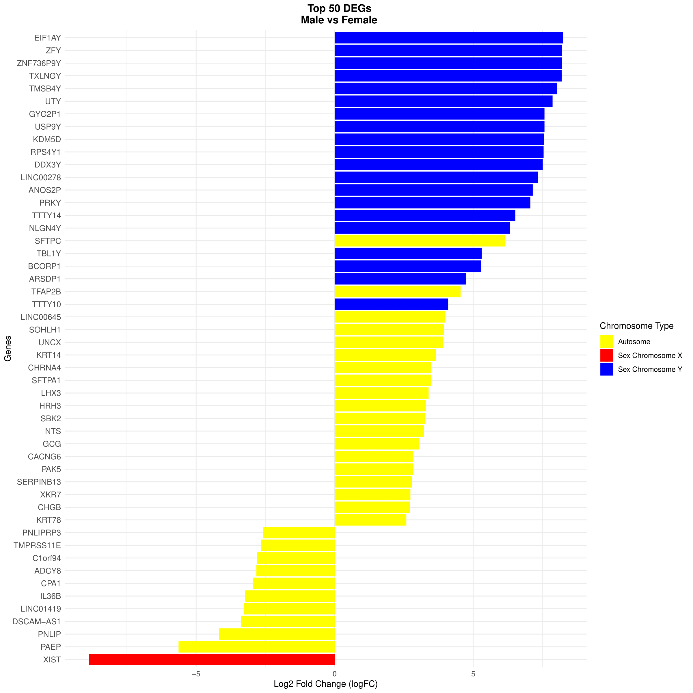

Below, the volcano plot showing the genes differentially expressed in males compared to females in terms of statistical significance (-log10FDR) and logFC is presented, highlighting the most significantly changing genes.

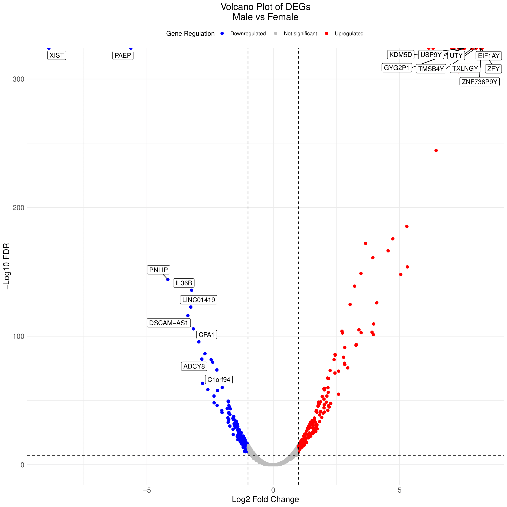

Also, the heatmap of the top 100 deregulated genes is shown below.

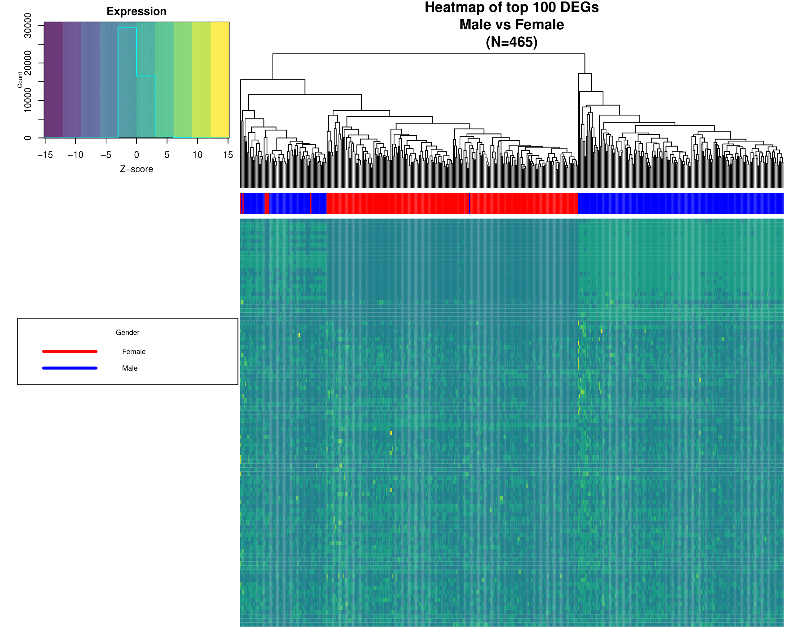

Although the study is specifically investigating biological differences between male and female samples, some genes need to be taken out of the analysis for the rest of the workflow because of their exclusive expression in one of the two sexes. Therefore, the rest of the analysis is done on genes located on autosomes and X chromosome, except for *XIST*.

The barplot of distribution of DEGs, the volcano plot and the heatmap were recomputed with the filtered set of DEGs that don't include *XIST* and genes located on the Y chromosome.

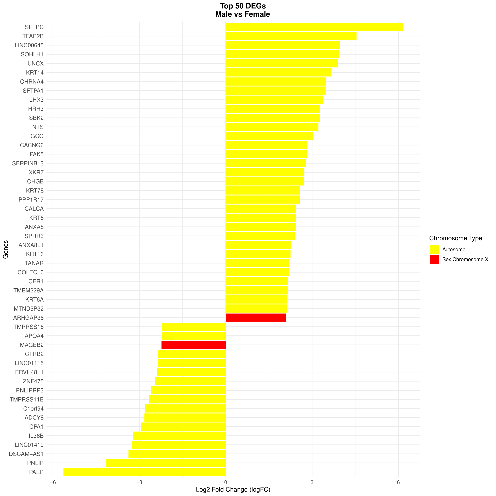

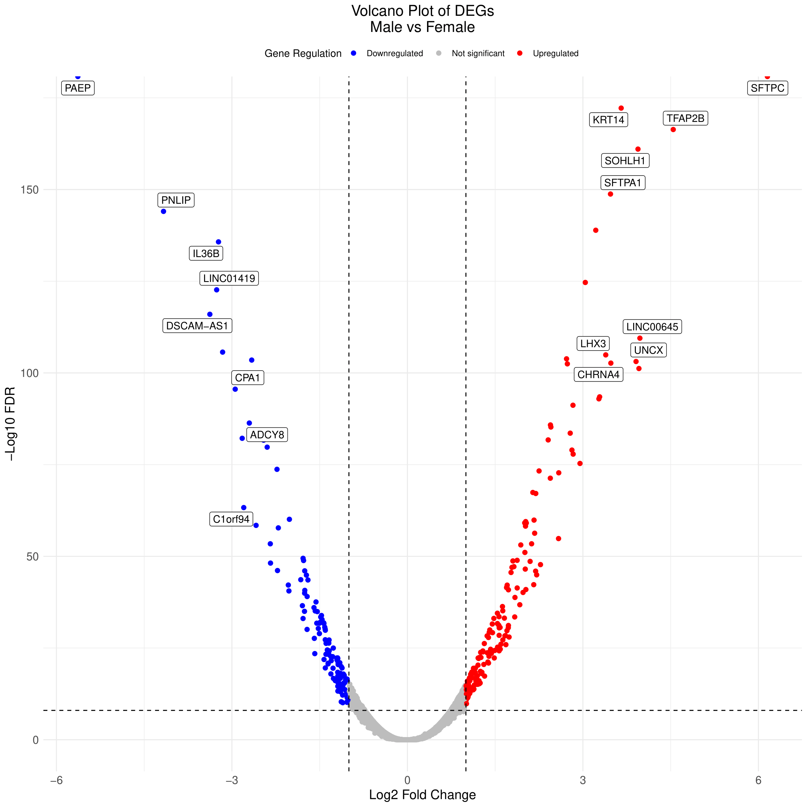

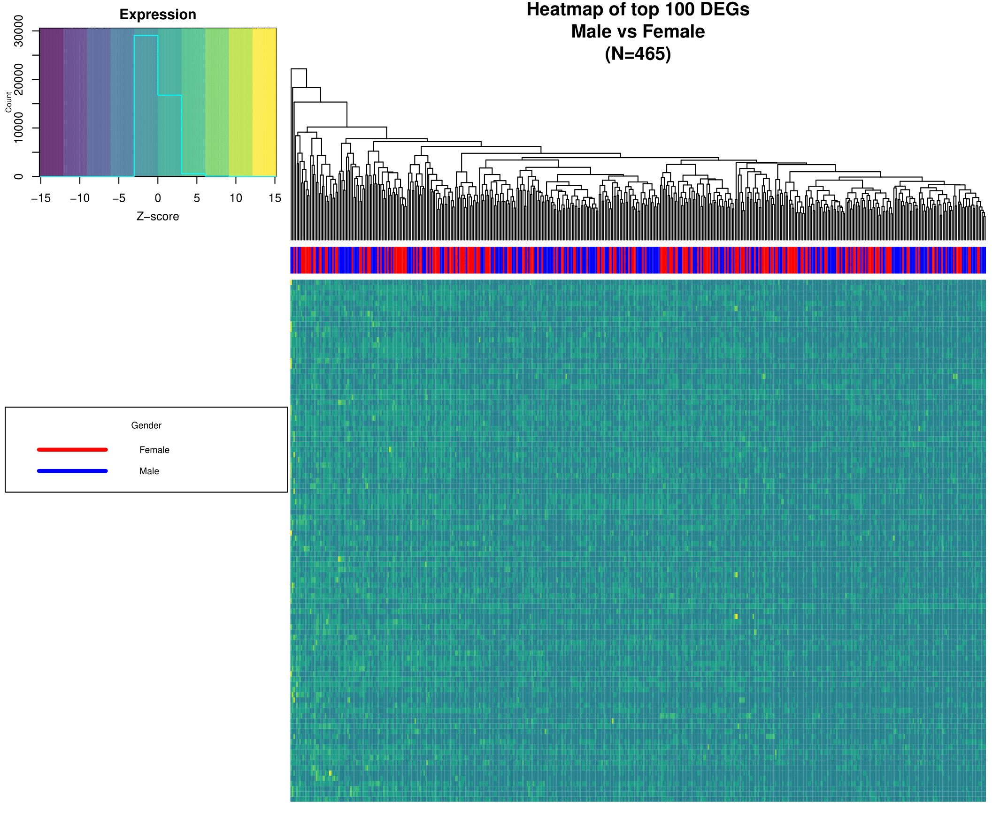

Interestingly, when comparing barplots of the top 50 DEGs by genomic location and expression changes, Y chromosome genes appear to show the most variation due to their absence in female samples. However, after removing these genes, we find that the majority of DEGs between male and female samples are located on autosomes, while X chromosome genes exhibit similar expression patterns across sexes. Notably, the heatmap of the top 100 DEGs, after filtering out *XIST* and Y-linked genes, reveals that these sex-specific genes play a role in clustering samples into distinct male and female groups.

### **Functional enrichment analysis**

Functional enrichment analysis was carried out using the `TCGAanaltze_EAcomplete` function from the `TCGAbiolinks` package on the DEGs (including *XIST* and Y-linked genes). The search was done on all Gene Ontology terms (Biological Process, Cellular Component, and Molecular Function), and KEGG Pathways.

Below, the barplots for Biological Process, Cellular Component, Molecular Function, and KEGG Pathway are presented for upregulated and downregulated genes, respectively.

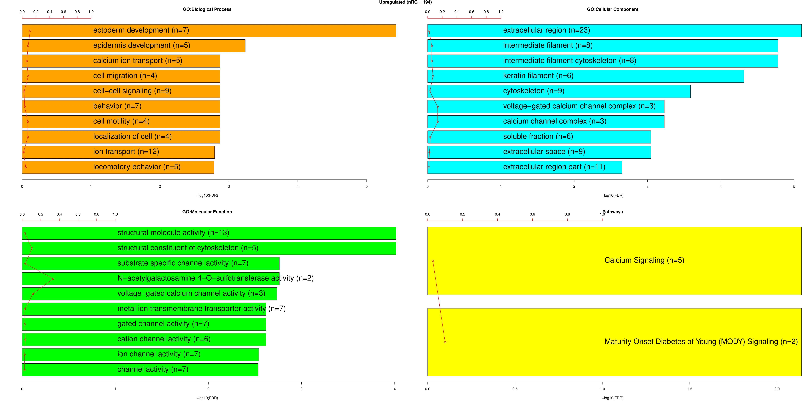

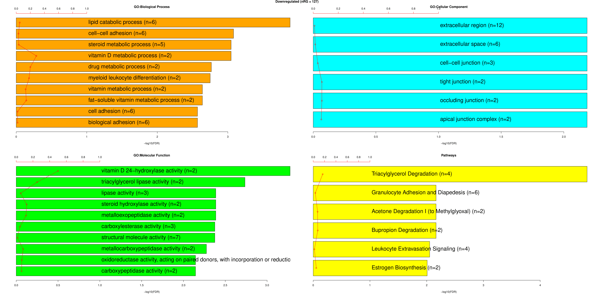

This analysis highlights what other studies have shown previously [4, 5], like the up-regulation of pathways related to hormonal synthesis and immune system functioning in females, confirming the idea that female patients might have a better outcome because of their immune system or the protective role of estrogen. 

### **Survival analysis**

A preliminary Kaplan-Meier (KM) curve was computed to assess whether sex was associated with overall survival (OS). However, no statistical significant association was found, likely due to limited number of events in the cohort. Regardless, there is a trend showing that male patient tend to have a worse prognosis than their counterpart.

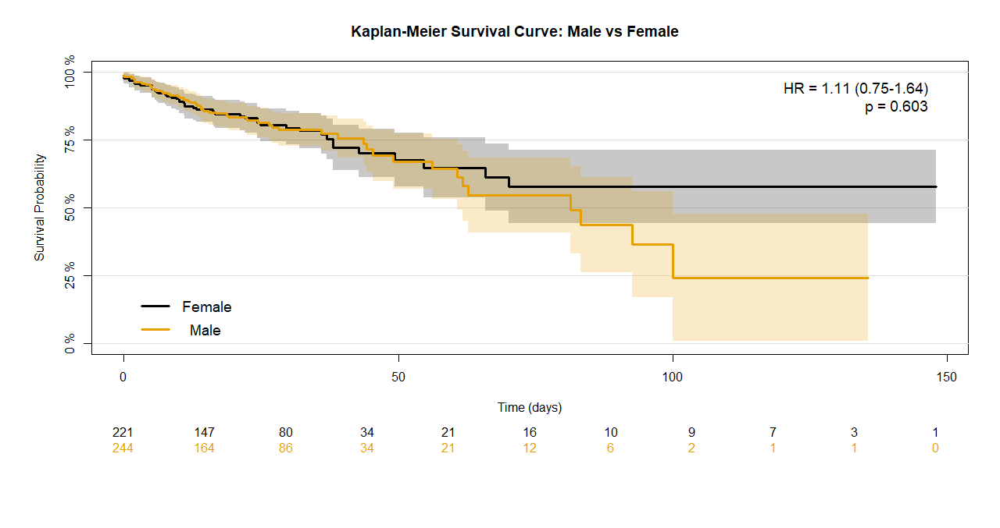

To evaluate the effect of individual DEGs on overall survival, Cox proportional hazard models were built. In particular, the models were built separately for the male and female cohort adjusting for clinical covariates that might act as potential confounders. To be more specific, clinical covariates used in the Cox PH models are the following:

- race (white, black/AA, other)
- age (<= 50, > 50)
- prior malignancy (no, yes)
- tumor stage (stage I, stage II, stage III, stage IV, other)
- primary site (right colon (proximal), transverse colon, left colon (distal))

Also, DEGs were categorized into high and low expression groups based on median value of expression.

Univariate Cox proportional hazards regression analysis showed that ... genes were statistically significantly correlated with overall survival at a p-value < 0.01. An FDR threshold < 0.01 further filtered out the candidate gene list to ... 

## **Discussion and Conclusion**

### **Limitations of the study**

## **References**

1. Wu Z, Huang Y, Zhang R, Zheng C, You F, Wang M, Xiao C, Li X. **Sex differences in colorectal cancer: with a focus on sex hormone-gut microbiome axis.** Cell Commun Signal. 2024 Mar 7;22(1):167. doi: 10.1186/s12964-024-01549-2. PMID: 38454453; PMCID: PMC10921775.

2. Nwaokorie A, Kolch W, Fey D. **A Systems Biology Approach to Understand the Racial Disparities in Colorectal Cancer.** Cancer Res Commun. 2024 Jan 12;4(1):103-117. doi: 10.1158/2767-9764.CRC-22-0464. PMID: 38051091; PMCID: PMC10785768.

3. Lopes-Ramos CM, Kuijjer ML, Ogino S, Fuchs CS, DeMeo DL, Glass K, Quackenbush J. **Gene Regulatory Network Analysis Identifies Sex-Linked Differences in Colon Cancer Drug Metabolism.** Cancer Res. 2018 Oct 1;78(19):5538-5547. doi: 10.1158/0008-5472.CAN-18-0454. Erratum in: Cancer Res. 2019 Apr 15;79(8):2084. doi: 10.1158/0008-5472.CAN-19-0678. PMID: 30275053; PMCID: PMC6169995.

4. Abancens M, Bustos V, Harvey H, McBryan J, Harvey BJ. **Sexual Dimorphism in Colon Cancer.** Front Oncol. 2020 Dec 9;10:607909. doi: 10.3389/fonc.2020.607909. PMID: 33363037; PMCID: PMC7759153.

5. Baraibar I, Ros J, Saoudi N, Salvà F, García A, Castells MR, Tabernero J, Élez E. **Sex and gender perspectives in colorectal cancer.** ESMO Open. 2023 Apr;8(2):101204. doi: 10.1016/j.esmoop.2023.101204. Epub 2023 Apr 3. PMID: 37018873; PMCID: PMC10163160.

