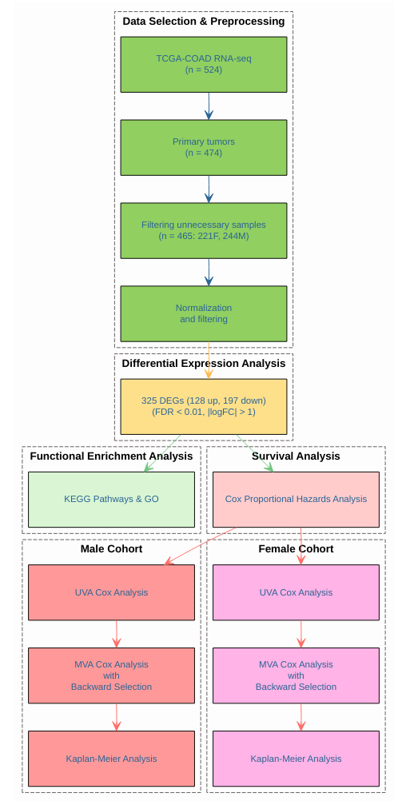

# Exploring Sex Differences in Colon Adenocarcinoma: A Transcriptomic Approach


## **Background**

Colorectal cancer (CRC) is the third most commonly diagnosed cancer and the second leading cause of cancer-related mortality worldwide [1]. The incidence and mortality rates of CRC vary across different demographic factors, including race, sex, and age [2].

Colon adenocarcinoma (COAD) exhibits clinically significant sex differences, with men tending to develop the disease earlier and experiencing worse outcomes compared to women [3]. These disparities suggest that underlying biological mechanisms related to sex differences may contribute to these clinical observations [3-5].

Understanding the molecular basis of these differences is essential for improving therapeutic strategies and patient outcomes. This project explores transcriptomic differences between male and female COAD patients using RNA-seq data from The Cancer Genome Atlas (TCGA). The aim is to identify potential biomarkers associated with sex-specific outcomes and overall survival (OS).


## **Biological question**

This study is guided by the following question: *Are there fundamental biological differences between males and females in colon adenocarcinoma that influence disease progression and survival?*

Specifically, this research investigates whether sex-specific gene expression patterns correlate with differences in prognosis and whether distinct gene signatures for males and females can predict OS outcomes.


## **Repository structure**

```
TCGA_COAD_sex_differences/
│-- Code/     # contains a scripts for data processing and analysis
│-- Data/     # contains raw and processed metadata
│-- Figures/  # contains figures generated during the analysis 
│-- LICENSE
│-- README.md
```


## **Project dependencies**

This project was conducted using R 4.4.2 and the following R packages:
- **Bioconductor Packages**:  
  - `TCGAbiolinks`  
  - `SummarizedExperiment`  
  - `biomaRt`
- **CRAN Packages**:  
  - `gplots`
  - `ggplot2`
  - `dplyr`
  - `gtsummary`
  - `viridis`
  - `prodlim`
  - `survival`
  - `DiagrammeR`


## **Data sources and workflow**

RNA-seq data from the TCGA-COAD cohort was downloaded using the `TCGAbiolinks` package. Clinical metadata, including survival information, was obtained from UCSC XENA and is available in the [Data folder](https://github.com/manal-agdada/TCGA_COAD_sex_differences/tree/main/Data), alongside the processed metadata used in this study.

Only primary tumor samples were included to minimize biases from normal or metastatic samples.


### **Analysis pipeline**

The workflow consists of:

1. Data selection, preprocessing, normalization, and filtering
2. Differential expression analysis using edgeR
3. Functional enrichment analysis
4. Survival analysis using Cox proportional hazards regression models and Kaplan-Meier curves

A schematic of the workflow is shown below.




## **Data processing**


### **Selection, preprocessing, normalization, and filtering**

- Only primary tumors samples were included, excluding normal and metastasis samples, resulting in 474 samples.
- Samples from patients who received prior treatments before tissue collection and sequencing were removed.
- Clinical covariantes considered are sex, age, race, prior malignancy, tumor site, tumor stage, OS time, and survival status.
- Samples with missing data were excluded, resulting in a final dataset of 465 samples (244 males, 221 females).

A summary of the cohort's clinical charateristics, stratified by sex, is shown below. All clinical data appear to be distributed homogeneously between male and female patients.


The gene expression matrix initially contained 60660 genes across 465 samples. Normalization was performed using the `TCGAanalyze_Normalization` function from the `TCGAbiolinks` package accounting for sequencing depth and gene length. After normalization, 38691 genes were removed as lowly expressed genes, leaving 21969 genes for downstream analysis.


## **Differential expression analysis**

Differential expression analysis was run to identify genes that are differentially expressed between males and females in COAD. The analysis was performed using the `TCGAanalyze_DEA` function from the `TCGAbiolinks` package using `edgeR` as pipeline. A significant threshold of FDR < 0.01 and |logFC| > 1 was applied to identify 325 differentially expressed genes (DEGs), with 128 upregulated and 197 downregulated in males. Also, 276 of these DEGs are located on autosomes, 19 on the X chromosome, and 26 on Y chromosome.

The barplot below illustrates the top 50 DEGs by logFC and genomic localization:


Below, the volcano plot highlights genes differentially expressed between males and females in terms of statistical significance (-log10FDR) and logFC, highlighting the most significantly changing genes:


A heatmap of the top 100 deregulated genes is shown below:


### **Filtering sex-specific genes**

Although the study is specifically investigating biological differences between male and female samples, some genes need to be taken out of the analysis for the rest of the workflow because of their exclusive expression in one of the two sexes. Therefore, the rest of the analysis is done on genes located on autosomes and X chromosome, except for *XIST*.

The barplot of distribution of DEGs, the volcano plot and the heatmap were recomputed with the filtered set of DEGs that don't include *XIST* and genes located on the Y chromosome.


Interestingly, when comparing barplots of the top 50 DEGs by genomic location and expression changes, Y chromosome genes appear to show the most variation due to their absence in female samples. However, after removing these genes, we find that the majority of DEGs between male and female samples are located on autosomes, while X chromosome genes exhibit similar expression patterns across sexes. Notably, the heatmap of the top 100 DEGs, after filtering out *XIST* and Y-linked genes, reveals that these sex-specific genes play a role in clustering samples into distinct male and female groups.


## **Functional enrichment analysis**

Functional enrichment analysis was carried out using the `TCGAanalyze_EAcomplete` function from the `TCGAbiolinks` package on the DEGs (including *XIST* and Y-linked genes). The search was done on all Gene Ontology terms (Biological Process, Cellular Component, and Molecular Function), and KEGG Pathways.

Below, the barplots for Biological Process, Cellular Component, Molecular Function, and KEGG Pathway are presented for upregulated and downregulated genes, respectively.


This analysis highlights what other studies have shown previously [4, 5], like the up-regulation of pathways related to hormonal synthesis and immune system functioning in females, confirming the idea that female patients might have a better outcome because of their immune system or the protective role of estrogen.


## **Survival analysis**

A preliminary Kaplan-Meier (KM) curve was computed to assess whether sex was associated with overall survival (OS). However, no statistically significant association was found, likely due to the limited number of events in the cohort. Regardless, there is a trend showing that male patients tend to have a worse prognosis than their female counterparts.


To evaluate the effect of individual DEGs on overall survival, Cox proportional hazard models were built. The models were constructed separately for the male and female cohort, adjusting for clinical covariates that might act as potential confounders. The following clinical covariates were included:

- race (white, black/AA, other)
- age (<= 50, > 50)
- prior malignancy (no, yes)
- tumor stage (stage I, stage II, stage III, stage IV, other)
- primary site (right colon (proximal), transverse colon, left colon (distal))

Also, DEGs were categorized into high and low expression groups based on the median expression value for KM curves.

Univariate Cox proportional hazards regression analysis, in the female and male cohort separately, identified several genes significantly correlated with overall survival with a FDR threshold < 0.1. In particular, 9 genes were identified in the female cohort and 66 genes in the male cohort. 

To further refine these signatures genes, multivariate Cox proportional hazards models were built, one per cohort. Starting from all the genes found significant in the previous step and builing the models using backward selection.

Below, the forest plot of the final multivariate model on the female cohort is represented:

Below, the forest plot of the final multivariate model on the male cohort in represented:


## **Discussion and Conclusion**


### **Limitations of the study**


## **References**


1. Wu Z, Huang Y, Zhang R, Zheng C, You F, Wang M, Xiao C, Li X. **Sex differences in colorectal cancer: with a focus on sex hormone-gut microbiome axis.** Cell Commun Signal. 2024 Mar 7;22(1):167. doi: 10.1186/s12964-024-01549-2. PMID: 38454453; PMCID: PMC10921775.

2. Nwaokorie A, Kolch W, Fey D. **A Systems Biology Approach to Understand the Racial Disparities in Colorectal Cancer.** Cancer Res Commun. 2024 Jan 12;4(1):103-117. doi: 10.1158/2767-9764.CRC-22-0464. PMID: 38051091; PMCID: PMC10785768.

3. Lopes-Ramos CM, Kuijjer ML, Ogino S, Fuchs CS, DeMeo DL, Glass K, Quackenbush J. **Gene Regulatory Network Analysis Identifies Sex-Linked Differences in Colon Cancer Drug Metabolism.** Cancer Res. 2018 Oct 1;78(19):5538-5547. doi: 10.1158/0008-5472.CAN-18-0454. Erratum in: Cancer Res. 2019 Apr 15;79(8):2084. doi: 10.1158/0008-5472.CAN-19-0678. PMID: 30275053; PMCID: PMC6169995.

4. Abancens M, Bustos V, Harvey H, McBryan J, Harvey BJ. **Sexual Dimorphism in Colon Cancer.** Front Oncol. 2020 Dec 9;10:607909. doi: 10.3389/fonc.2020.607909. PMID: 33363037; PMCID: PMC7759153.

5. Baraibar I, Ros J, Saoudi N, Salvà F, García A, Castells MR, Tabernero J, Élez E. **Sex and gender perspectives in colorectal cancer.** ESMO Open. 2023 Apr;8(2):101204. doi: 10.1016/j.esmoop.2023.101204. Epub 2023 Apr 3. PMID: 37018873; PMCID: PMC10163160.

